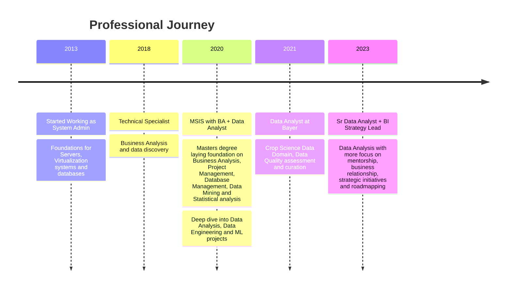

### The Philosophy of Integrity
I believe that data is a human problem solved with technical precision. My 12-year journey hasn't been about moving from one tool to another, but about moving closer to the truth. I view my role as a practitioner of "Analytical Clarity"—distilling the noise of raw, fragmented datasets into the signal of actionable evidence.

I don't just build dashboards; I build the relationships necessary to understand a pain point and the architectural logic necessary to ensure the resulting insight is unshakeable.

---

### The Professional Roadmap
A trajectory from Infrastructure Stability to Strategic Data Action.

---
### The Full-Lifecycle Approach
I operate at the intersection of technical architecture and strategic execution. My methodology is built on five pillars of impact:

* **Relationship & Discovery:** I partner with business leaders to extract the true organizational pain point before a single line of code is committed.

* **Process Mastery:** I navigate fragmented, messy, or missing datasets to establish the rules required to find the "truth" in the data.

* **Architectural Consultation:** I advise on the definitions and transformations required at the source to ensure long-term scalability and stability.

* **Visual Storytelling:** I transform raw technical complexity into high-trust visual evidence that enables high-stakes decision-making.

* **Mentorship & Translation:** I find significant leverage in bridging the gap between technical rigor and executive clarity, helping non-tech leaders act with statistical confidence.

---
### Mentorship & Influence
I find my greatest organizational leverage in translation. I enjoy mentoring junior analysts to navigate raw data complexity and training non-technical stakeholders to interpret data with ease. I believe that a leader’s role is to ensure that technical architecture and analytical rigor are perfectly aligned with business goals.

<!-- This script allows the Mermaid diagram to render on GitHub Pages -->

